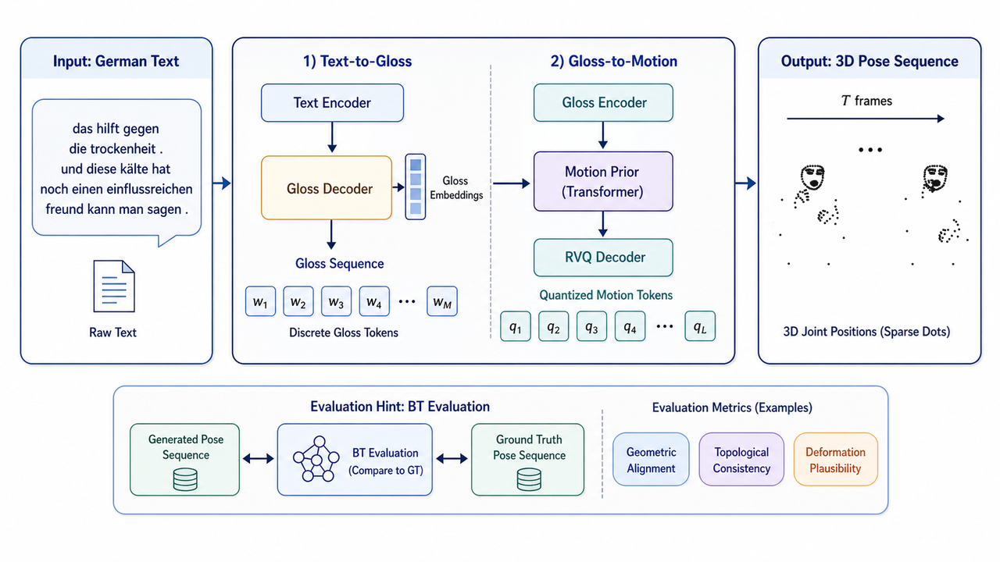
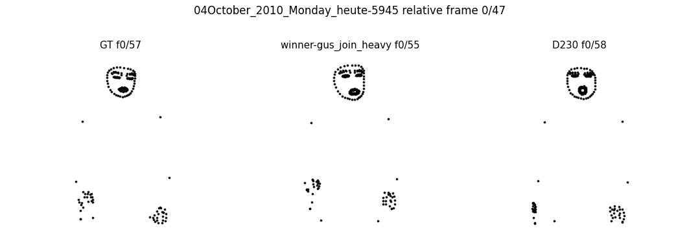

# T2S-MotionTok

T2S-MotionTok is a lightweight Text-to-Sign production code release based on discrete motion tokens. Given German text, the pipeline predicts a gloss sequence, generates RVQ motion tokens, and decodes them into a 3D pose sequence.

```text
text -> gloss -> motion tokens -> pose sequence
```

This repository is intentionally minimal: it contains method code, evidence aggregation scripts, one pipeline figure, and one qualitative demo. It does not include datasets, checkpoints, evaluator weights, BT-model weights, or large prediction files.

## Demo





`D230` is the experiment number of our final model.

## Installation

```bash
git clone <your-repo-url>
cd T2S-MotionTok

conda create -n t2s-motiontok python=3.10 -y
conda activate t2s-motiontok
pip install -r requirements.txt
```

Recommended environment:

- Linux
- Python 3.10+
- PyTorch 2.x
- CUDA GPU for training or full-split inference

## External Files Needed

Prepare these files locally before running the full pipeline:

```text
T2S-MotionTok/
├── data/
│   └── slrtp/                         # PHOENIX14T / SLRTP data
├── checkpoints/
│   ├── rvq_tokenizer_best.pt
│   ├── coarse_prior_best.pt
│   └── detail_prior_best.pt
├── external/
│   └── SLRTP-Sign-Production-Evaluation/
└── outputs/
```

The official SLRTP evaluator and its BT model are external dependencies. Put them under `external/` or update the script arguments to your local paths.

## Usage

All scripts expose command-line arguments:

```bash
python src/rvq_tokenizer_experiment.py --help
python src/rvq_aligned_prior_experiment.py --help
python src/hybrid_rvq_decode.py --help
```

### 1. Train the RVQ tokenizer

```bash
python src/rvq_tokenizer_experiment.py   --project-root .   --out-dir outputs/rvq_tokenizer   --posthoc-rvq   --window-size 4   --stride 2   --n-quantizers 8   --n-codes 1024   --latent-dim 256
```

### 2. Train the motion-token prior

Coarse prior template:

```bash
python src/rvq_aligned_prior_experiment.py   --project-root .   --out-dir outputs/coarse_prior   --tokenizer-ckpt checkpoints/rvq_tokenizer_best.pt   --token-cache-dir outputs/token_cache   --pred-layers 3   --alignment-mode full   --duration-scale 1.332   --teacher-kl-weight 0.3   --stable-token-kl-weight 0.05
```

Detail prior template: use the same script with `--pred-layers 4` and initialize/distill from the coarse prior if reproducing the final setup.

### 3. Decode pose sequences

```bash
python src/hybrid_rvq_decode.py   --project-root .   --out-dir outputs/final_decode   --tokenizer-ckpt checkpoints/rvq_tokenizer_best.pt   --token-cache-dir outputs/token_cache   --coarse-ckpt checkpoints/coarse_prior_best.pt   --detail-ckpt checkpoints/detail_prior_best.pt   --duration-scale 1.332   --config-id beam5_lp0p8_max100   --eval-split dev   --skip-eval
```

Remove `--skip-eval` only after the official evaluator, data split, and BT model are correctly configured.

## Main Scripts

- `src/rvq_tokenizer_experiment.py`: train the RVQ tokenizer.
- `src/rvq_aligned_prior_experiment.py`: train the alignment-aware motion-token prior.
- `src/hybrid_rvq_decode.py`: combine coarse and detail priors and decode poses.
- `src/build_predicted_gloss_duration_stats.py`: build duration statistics from predicted glosses.
- `src/select_visual_samples.py`: select qualitative samples.
- `src/visualize_pose_comparison.py`: render pose comparison GIFs.
- `src/prepare_public_phoenix_adapter.py`, `src/export_public_prediction_skels.py`: helper scripts for public-data adaptation/export.

## Evidence Scripts

The paper/report evidence is organized into four claim groups. The scripts below aggregate existing evaluator JSON, CSV, or diagnostic files into tables/figures under `outputs/evidence/`. They do not rerun the official evaluator by default. By default each script writes both CSV and Markdown; use `--format csv`, `--format md`, or `--format csv,md` to control outputs.

### Claim 1: Official Main Test Evaluation

Generates the main test table comparing GT self, official reference systems, and T2S-MotionTok.

```bash
python evidence/make_main_results.py \
  --ours-json path/to/ours_test_eval.json \
  --gt-self-json path/to/gt_self_test_eval.json \
  --out-dir outputs/evidence
```

Use `--reference-csv path/to/official_references.csv` if you want to provide full Team 1/2/3 rows instead of the built-in reference numbers.

### Claim 2: Component Ablation

Generates the test ablation table for alignment, duration, detail layer, and Text2Gloss beam search.

```bash
python evidence/make_test_ablation.py \
  --full-json path/to/full_test_eval.json \
  --wo-alignment-json path/to/wo_alignment_test_eval.json \
  --wo-duration-json path/to/wo_duration_test_eval.json \
  --wo-detail-json path/to/wo_detail_test_eval.json \
  --wo-beam-json path/to/wo_beam_test_eval.json \
  --out-dir outputs/evidence
```

### Claim 3: Duration Calibration Sweep

Generates the dev duration sweep table and, optionally, a plot.

```bash
python evidence/make_duration_sweep.py \
  --run 0.9:path/to/duration_0p9_dev_eval.json \
  --run 1.332:path/to/duration_1p332_dev_eval.json \
  --run 1.6:path/to/duration_1p6_dev_eval.json \
  --plot \
  --out-dir outputs/evidence
```

### Claim 4: Evaluator Diagnostic Examples

Generates per-sample diagnostic tables. If GT/Ours pose tensors are provided, it can also compute duration ratio, jerk, and frame-slice figures.

```bash
python evidence/make_evaluator_diagnostics.py \
  --cases-json path/to/diagnostic_cases.json \
  --out-dir outputs/evidence
```

Optional motion-quality rendering:

```bash
python evidence/make_evaluator_diagnostics.py \
  --cases-json path/to/diagnostic_cases.json \
  --gt-pose-pt path/to/dev_or_test_gt.pt \
  --ours-pose-pt path/to/ours_prediction.pt \
  --render-slices \
  --out-dir outputs/evidence
```

## License

MIT License.
